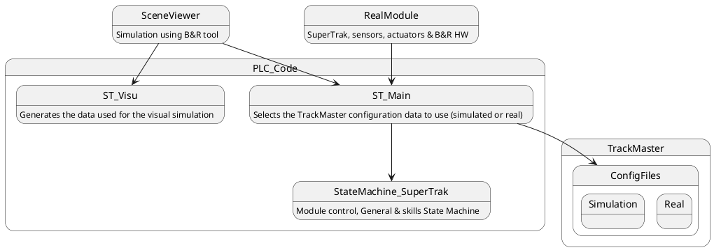

# PLC-code

```plantuml
@startuml

state SceneViewer
state RealModule 

state TrackMaster {
  state ConfigFiles {
    state Simulation
    state Real
}
}

state PLC_Code{
  state ST_Main 
  state StateMachine_SuperTrak
  state ST_Visu
}

SceneViewer --> ST_Main
SceneViewer --> ST_Visu

RealModule --> ST_Main

ST_Main--> ConfigFiles 
ST_Main--> StateMachine_SuperTrak

SceneViewer: Simulation using B&R tool
RealModule: SuperTrak, sensors, actuators & B&R HW
ST_Main: Selects the TrackMaster configuration data to use (simulated or real)
StateMachine_SuperTrak: Module control, General & skills State Machine 
ST_Visu: Generates the data used for the visual simulation

@enduml
```

This project contains the plc code from the assembly and Supertrak
